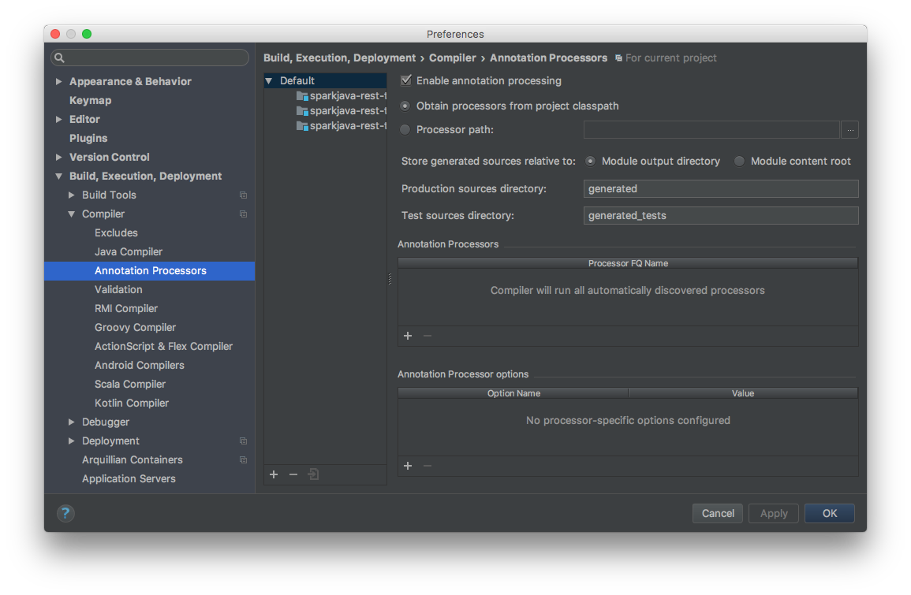

# Kotlin Spark REST Template

[](https://travis-ci.org/michalkowol/kotlin-template)
[](https://codecov.io/github/michalkowol/kotlin-template?branch=master)

## Architecture

### Package By Feature

Package-by-feature uses packages to reflect the feature set. It tries to place all items related to a single feature (and only that feature) into a single directory/package. This results in packages with high cohesion and high modularity, and with minimal coupling between packages. Items that work closely together are placed next to each other. They aren't spread out all over the application. It's also interesting to note that, in some cases, deleting a feature can reduce to a single operation - deleting a directory. (Deletion operations might be thought of as a good test for maximum modularity: an item has maximum modularity only if it can be deleted in a single operation.)

Source: http://www.javapractices.com/topic/TopicAction.do?Id=205

### HTTP

Thread HTTP only as your transporting layer. Try to avoid leaking HTTP logic into your briskness logic. Utilize **domain-driven design**.

## Build

### Default

```bash
gradle
```

### Build

```bash
gradle build
```

### Run

```bash
gradle run
```

### Tests

```bash
gradle check
```

### Continuous tests

```bash
gradle test -t
```

or

```bash
gradle test --continuous
```

### Integration tests
    
```bash
gradle integrationTest
```

### FatJar

Sometimes you need to remove jars signatures:

`build.gradle`:

```groovy
// ...
task fatJar(type: Jar) {
    baseName = "${project.name}-assembly"
    manifest = jar.manifest
    exclude('META-INF/*.SF')
    exclude('META-INF/*.DSA')
    exclude('META-INF/*.RSA')
    from { configurations.compile.collect { it.isDirectory() ? it : zipTree(it) } }
    with jar
}
// ...
```

```bash
gradle fatJar

java -jar build/libs/${NAME}-assembly-${VERSION}.jar

java -Denvironment=dev -jar build/libs/${NAME}-assembly-${VERSION}.jar
java -Denvironment=qa -jar build/libs/${NAME}-assembly-${VERSION}.jar
java -Denvironment=staging -jar build/libs/${NAME}-assembly-${VERSION}.jar
java -Denvironment=production -jar build/libs/${NAME}-assembly-${VERSION}.jar
```

### Code coverage

```bash
gradle jacocoTestReport
open build/jacocoHtml/index.html
```

## PostgreSQL

### Docker

```bash
docker run --name softwareberg-postgres-db -p 5432:5432 -e POSTGRES_DB=softwareberg -e POSTGRES_USER=softwareberg -e POSTGRES_PASSWORD=softwareberg -d postgres:9.6
```

### Library

`build.gradle`:

```groovy
// ...
dependencies {
    // ...
    compile 'org.postgresql:postgresql:9.4.+'
    // ...
}
// ...
```

### Configuration

`application.properties`:

```properties
# ...
datasource.jdbcUrl=jdbc:postgresql://localhost:5432/softwareberg
datasource.username=softwareberg
datasource.password=softwareberg
# ...
```

## Heroku

### Test on local

```bash
heroku local web
```

### Deploy

```bash
heroku login
heroku create
git push heroku master
heroku logs -t
```

or

```bash
heroku git:remote -a NAME_OF_APP
git push heroku master
heroku logs -t
```

http://kotlin-template.herokuapp.com/

## IntelliJ

Remember to turn on "Annotation Predecessors"



## Server side rendering

As server side rendering template I recommend [Thymeleaf](http://www.thymeleaf.org/) or (for very simple pages) [Mustache](https://mustache.github.io/).

To use Thymeleaf with Spark you need to include `Thymeleaf ResponseTransformer` in `build.gradle`

```groovy
compile 'com.sparkjava:spark-template-mustache:2.5.+'
```

and then add it to router

```java
// ...
ThymeleafTemplateEngine templateEngine = // ...
// ...
// hello.html file is in resources/templates directory
ImmutableMap.of("name", "Sam")
get("/hello", (request, response) -> new ModelAndView(map, "hello"), templateEngine);
// ...
```

## Code snippets 

### Dagger

`build.gradle`:

```groovy
// ...
apply plugin: 'kotlin-kapt'
// ...
sourceSets {
    // for IntelliJ
    main.java.srcDirs += "$buildDir/generated/source/kapt/main"
}
// ...
dependencies {
    // ...
    compile 'com.google.dagger:dagger:2.+'
    kapt 'com.google.dagger:dagger-compiler:2.+'
    // ...
}
// ...
```

```kotlin
import dagger.Component
import dagger.Module
import dagger.Provides
import javax.inject.Inject

interface Pump {
    fun pump(): String
}
interface Heater {
    fun heat(): String
}

class Thermosiphon @Inject constructor(private val heater: Heater) : Pump {
    override fun pump(): String {
        heater.heat()
        return "=> => pumping => =>"
    }
}

class ElectricHeater : Heater {
    override fun heat(): String = "~ ~ ~ heating ~ ~ ~"
}

data class CoffeeMaker @Inject constructor(val heater: Heater, val pump: Pump) {
    fun brew(): String {
        val heat = heater.heat()
        val pump = pump.pump()
        val coffee = " [_]P coffee! [_]P "
        return "$heat\n$pump\n$coffee"
    }
}


@Module
class DripCoffeeModule {
    @Provides fun provideHeater(): Heater = ElectricHeater()
    @Provides fun providePump(pump: Thermosiphon): Pump = pump
}

@Component(modules = arrayOf(DripCoffeeModule::class))
interface CoffeeShop {
    fun maker(): CoffeeMaker
}

fun main(args: Array<String>) {
    val coffeeShop = DaggerCoffeeShop.builder().build()
    val maker = coffeeShop.maker()
    println(maker.brew())
}
```

### Autoclosable

```kotlin
import java.lang.AutoCloseable

inline fun <T : AutoCloseable?, R> T.use(block: (T) -> R): R {
    var exception: Throwable? = null
    try {
        return block(this)
    } catch (e: Throwable) {
        exception = e
        throw e
    } finally {
        when {
            this == null -> {}
            exception == null -> close()
            else ->
                try {
                    close()
                } catch (closeException: Throwable) {
                    exception.addSuppressed(closeException)
                }
        }
    }
}
```

```kotlin
someAutoCloseable.use { r ->
    // ...
}
```

### Kovenant (deprecated - use [Coroutines](https://blog.jetbrains.com/kotlin/2016/07/first-glimpse-of-kotlin-1-1-coroutines-type-aliases-and-more/) instead)

```kotlin
// compile 'nl.komponents.kovenant:kovenant:3.0.0'

import nl.komponents.kovenant.*
import nl.komponents.kovenant.functional.*

fun longOperation(url: String): Promise<String, Exception> = task {
    val result = // ...
    result
}

fun foo(key: String): Promise<String, Exception> {
    val url = getUrl(key) ?: return Promise.ofFail(Exception("Not Found"))
    return longOperation(url)
}

val success = Promise.of("aa")
val result: String = success.get
val bar = foo("google.com").map { result -> "foo $result bar" }
val foo3 = combine(foo("google.com"), foo("google.com"), foo("google.com")).success { it.first + it.second + it.third }
val foofoo = foo("google.com") and foo("google.com") success { it.first + it.second }
val foosFutures: List<Promise<String, Exception>> = listOf(foo("google.com"), foo("google.com"))
val futureFoos: Promise<List<String>, Exception> = all(foosFutures)
val nested: Promise<String, Exception> = foo("google.com").bind { result -> foo(result) }
```

### Injekt

```kotlin
// compile 'uy.kohesive.injekt:injekt-core:1.14.+'

import uy.kohesive.injekt.*
import uy.kohesive.injekt.api.*

interface Animal
class Dog : Animal
class Cat : Animal

class AnimalContainer(val animal: Animal)

class A(val b: B, val c: C)
class B
class C(val d: D)
class D

class Boot {
    companion object : InjektMain() {
        @JvmStatic public fun main(args: Array<String>) {
            Boot().run()
        }

        override fun InjektRegistrar.registerInjectables() {
            addLoggerFactory({ byName -> LoggerFactory.getLogger(byName) }, { byClass -> LoggerFactory.getLogger(byClass) })
            addSingleton(D())
            addSingleton(C(Injekt.get()))
            addSingleton(B())
            addFactory { A(Injekt.get(), Injekt.get()) }

            addSingleton(Dog())
            addSingleton<Animal>(Cat())
            addFactory { AnimalContainer(Injekt.get()) }
        }
    }

    private val log: Logger by injectLogger()

    fun run() {
        val locallog = Injekt.logger<Logger>(Boot)
        log.debug("Hello!")

        val a1 = Injekt.get<A>()
        val a2 = Injekt.get<A>()
        log.debug("a: $a1 b: ${a1.b} c: ${a1.c} d: ${a1.c.d}")
        log.debug("a: $a2 b: ${a2.b} c: ${a2.c} d: ${a2.c.d}")

        val animalContainer = Injekt.get<AnimalContainer>()
        log.debug("$animalContainer ${animalContainer.animal}")
    }
}
```

## References
* [Kovenant - Promises for Kotlin](https://github.com/mplatvoet/kovenant)
* [Injekt - Dependency Injection for Kotlin](https://github.com/kohesive/injekt)
* [kotlinx.coroutines - libraries built upon Kotlin coroutines](https://github.com/Kotlin/kotlinx.coroutines)
